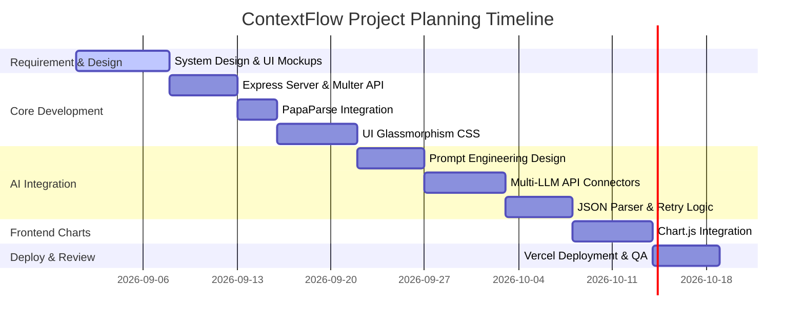

# _**<u>PROJECT Synopsis</u>**_
**(Font: Bookman Old Style, Size: 28, Bold)**

## _**<u>ON</u>**_
**(Font: Times New Roman, Size: 14, Bold)**

# _**<u>ContextFlow: Conversational Data Intelligence and Visualization System</u>**_
**(Font: Times New Roman, Size: 18, Bold)**

## _**<u>IN</u>**_
**(Font: Times New Roman, Size: 14, Bold)**

## _**<u>DEPARTMENT OF COMPUTER SCIENCE AND ENGINEERING</u>**_
**(Font: Times New Roman, Size: 14, Bold)**

### _**<u>SUBMITTED IN PARTIAL FULFILLMENT OF THE DEGREE OF</u>**_
**(Font: Times New Roman, Size: 12, Bold, Italic)**

# _**<u>BE (CSE)</u>**_
**(Font: Times New Roman, Size: 14, Bold)**

---

### **Submitted By:**
* **Name:** Bhavya Mahajan  
* **University ID No.:** [Your University ID No.]  
* **Department:** Computer Science and Engineering  
**(Font: Times New Roman, Size: 12, Bold)**

---

# **Chitkara University, Himachal Pradesh**
**(Font: Times New Roman, Size: 14, Bold)**

---

<div style="page-break-after: always;"></div>

# _**<u>1. Introduction to Project</u>**_
**(Font: Times New Roman, Size: 16, Bold, Italic, Underlined)**

### **1.1 Project Overview**
In the modern business landscape, data is generated at an unprecedented scale. However, extracting actionable insights from raw data remains a major bottleneck. Traditional data analysis tools—such as complex spreadsheet software, database querying interfaces, or enterprise business intelligence (BI) systems—require technical expertise, specialized training, and a strong understanding of mathematical formulas or query languages (like SQL). This creates a dependency loop where non-technical decision-makers (such as managers, marketers, and operators) must wait for dedicated data analysts to extract, compile, and visualize their reports.

**ContextFlow** is a conversational intelligence system designed to democratize data analysis. It allows users to upload standard structured files (specifically in Comma-Separated Values (CSV) format) and query their datasets using plain, conversational English. Instead of building pivot tables, writing nested formulas, or scripting database commands, a user can simply ask: *"Which region generated the highest revenue in Q1?"* or *"What is our sales trend over the last six months?"*

The system immediately processes the request, parses the tabular data, constructs a specialized contextual prompt, and forwards it to a Large Language Model (LLM). The LLM processes the dataset in conjunction with the natural language query and generates a response structured according to a strict JSON schema. This schema contains:
1. A direct textual answer explaining the findings in natural language.
2. A visualization model indicating whether a chart is appropriate, what type of chart is recommended (bar, line, pie, etc.), and the exact data points (labels and values) to plot.

The frontend receives this response and dynamically renders the visualization in the browser using a high-performance graphing canvas. By utilizing client-side configurations and an option for multi-provider API selection, ContextFlow ensures a highly portable, flexible, and secure environment.

---

### **1.2 Technology Stack**
The technical architecture of ContextFlow is designed to be lightweight, modular, and easy to deploy, avoiding unnecessary compilation and build overhead while utilizing robust, modern components:

* **Frontend Development:** 
  * **HTML5 & CSS3:** Structural layout built using semantic HTML5 tags and styled with modern styling features. The application implements a responsive **Glassmorphism Design System** (employing transparent overlay backdrops, blur filters, and micro-interactions) to provide a premium, modern aesthetic without compromising browser performance.
  * **Vanilla JavaScript:** High-performance, client-side scripting to handle API key configurations, parse selected radio states, format file upload boundaries, handle client-side form validations, and coordinate asynchronous requests.
* **Data Visualization:**
  * **Chart.js:** A flexible, canvas-based JavaScript charting library loaded dynamically. It consumes the structured JSON visualization payloads from the backend and renders highly interactive, responsive charts directly within the viewport.
* **Backend Application Server:**
  * **Node.js & Express.js:** The core backend application server. It serves static client assets, hosts the API endpoints, handles network routing, and manages the logic layer connecting the parser with the downstream LLM endpoints.
* **File Processing:**
  * **Multer:** An Express middleware designed specifically for handling `multipart/form-data`. It receives raw file streams uploaded from the browser and stores them in memory buffers (or temporary files) for processing.
  * **PapaParse:** A high-speed, robust CSV parser integrated server-side. It takes the uploaded file buffer, parses it, handles comma/quote escapes, and outputs a structured array of JSON objects representing the dataset rows.
* **Artificial Intelligence Integration:**
  * **Multi-Provider Pipeline:** Instead of coupling the application to a single AI provider, the backend is integrated with three state-of-the-art LLM platforms:
    1. **Google Gemini API:** Utilized as the default, cost-effective provider.
    2. **OpenAI API (GPT-4o-mini):** Integrated for high-precision linguistic and numerical reasoning.
    3. **Groq Cloud (Llama 3.3):** Configured via direct HTTP REST calls to provide high-speed inference.

---

### **1.3 Project Field and Specialization**
This project falls under the following specialized fields of Computer Science and Engineering:
1. **Conversational Business Intelligence (BI):** Transitioning data manipulation interfaces from command/mouse interfaces to conversational workflows.
2. **Applied Natural Language Processing (NLP):** Using LLMs to translate unstructured questions into structured analytical actions.
3. **Data Science and Interactive Visualization:** Automating the generation of graphical representations from tabular database sources.

---

### **1.4 Special Technical Terms**
* **Large Language Model (LLM):** Deep learning algorithms trained on massive text datasets capable of processing prompts, executing reasoning tasks, and generating structured formats like JSON.
* **Prompt Engineering:** The systematic process of structuring instructions, schemas, and context inside a text template to guide LLM outputs towards safety, precision, and adherence to strict formats.
* **CSV Parsing:** The conversion of raw Comma-Separated Values text, including edge-cases (such as line breaks or embedded commas inside quotes), into structured memory structures.
* **Glassmorphism:** A UI styling technique characterized by frosted-glass effects (achieved using `backdrop-filter: blur()`), light borders, translucent backgrounds, and subtle gradients.
* **Exponential Backoff:** An algorithmic retry mechanism that doubles the wait time after each consecutive rate-limit failure (HTTP 429), preventing server overloading and ensuring API query completion.
* **JSON Schema Verification:** Programmatic validation of the AI's response to ensure it contains required properties (such as `answer` and `visualization`) before sending it to the client.

---

<div style="page-break-after: always;"></div>

# _**<u>2. Literature Survey</u>**_
**(Font: Times New Roman, Size: 16, Bold, Italic, Underlined)**

### **2.1 Comparison of Existing Systems and Gaps**
To understand the position of ContextFlow, it is essential to compare traditional and modern approaches to data interaction:

| System Name | Interface | Complexity | Core Strengths | Key Technical Gaps / Disadvantages |
| :--- | :--- | :--- | :--- | :--- |
| **Traditional Spreadsheets** *(Excel, Google Sheets)* | GUI / Manual Input | Medium | Powerful formula engine, universal availability, fine-grained control. | Requiring manual entry of formulas (VLOOKUP, SUMIFS); prone to structural errors; difficult for non-technical users to build interactive charts quickly. |
| **Enterprise BI Platforms** *(Tableau, PowerBI)* | GUI / SQL-based | High | Deep database integrations, massive scaling, drag-and-drop dashboards. | High license costs, steep learning curves, require complex SQL schemas, and long lead times for generating custom views. |
| **Python Libraries** *(Pandas, Matplotlib, Jupyter)* | Code | High | Unlimited computational power, advanced statistical modeling, custom charts. | Completely inaccessible to non-programmers; requires local development environments and execution environments. |
| **General AI Chatbots** *(ChatGPT, Claude Web Interface)* | Conversational | Low | Great generic responses, code generation, summarization. | Cannot render charts natively inside the chat interface based on uploaded data without specialized enterprise subscriptions. Often suffer from "hallucinations" of numbers if not properly bounded. |
| **LangChain Data Agents** | Conversational | High (backend) | Dynamic code execution (running python commands in a sandbox to query CSVs). | High computing costs, token-heavy execution loops, slow response times, and significant security vulnerabilities due to local execution of dynamic AI-generated code. |
| **ContextFlow (Proposed)** | **Conversational** | **Low** | **Lightweight, client-configured, instant visual chart generation, secure sandbox.** | **Designed for light-to-medium CSV analysis; does not connect to distributed relational database servers directly (yet).** |

---

### **2.2 Critical Gaps Solved by ContextFlow**
1. **The "Code Execution" Security Risk:** Many modern conversational data analysts work by letting the LLM write and execute arbitrary Python script on the server. If the LLM generates a malicious script (or if a user executes a prompt-injection attack), the backend server can be compromised. ContextFlow solves this by running zero code. Instead, it extracts the data schema, sends a sample to the LLM, and gets back a static *data visualization model* (JSON). The rendering happens on the frontend client canvas, which is entirely sandbox-secured.
2. **High Latency and Token Overhead:** Traditional agents operate in multi-step "React" loops (Reasoning + Acting), requiring multiple round-trips to the LLM to write code, execute it, read error outputs, and try again. This consumes thousands of tokens and takes 15–30 seconds. ContextFlow uses a single-shot prompt design asking for specific JSON output. It completes the query in 2–5 seconds with minimal token consumption.
3. **Data Lock-in and Key Management:** Many enterprise AI tools require users to upload their data to centralized servers and use the company’s internal, paid API keys. ContextFlow is built with a client-focused approach where users can paste their own Google Gemini, OpenAI, or Groq API keys directly into the interface. Keys are never stored on the server, ensuring privacy, data sovereignty, and zero operational billing overhead for the service host.

---

<div style="page-break-after: always;"></div>

# _**<u>3. Methodology/ Planning of work</u>**_
**(Font: Times New Roman, Size: 16, Bold, Italic, Underlined)**

### **3.1 System Architecture Flow**
The system logic is divided into three key layers operating in a synchronized request-response lifecycle:

```mermaid
sequenceDiagram
    autonumber
    actor User as Business User
    participant FE as Frontend (Vanilla JS + CSS)
    participant BE as Backend (Express Server)
    participant AI as AI Provider (Gemini/OpenAI/Groq)

    User->>FE: Input API Key & Upload CSV
    FE->>BE: Upload File (Multipart FormData via Fetch)
    Note over BE: Multer stores file;<br/>PapaParse extracts rows & headers
    BE-->>FE: Acknowledge Upload Success
    User->>FE: Type Natural Language Question
    FE->>BE: POST Query Request (Question + Provider Selection)
    Note over BE: Backend builds structured prompt<br/>containing dataset schema & sample rows
    BE->>AI: Send Prompt Request (with retry logic)
    AI-->>BE: Return JSON payload with Answer & Chart config
    Note over BE: Parse JSON, strip Markdown backticks,<br/>validate fields, execute backoff on 429
    BE-->>FE: Send Response JSON
    FE->>FE: Render text answer; invoke Chart.js
    FE-->>User: Display answer with interactive Chart
```

---

### **3.2 Phase-wise Project Implementation Plan**



* **Phase 1: Requirements Analysis and Interface Design:** Reviewing the requirements for CSV uploads and natural language processing. Designing the UI using modern CSS patterns, establishing visual mockups for the dashboard layout.
* **Phase 2: Express Server & Parsing Pipelines:** Building the Node.js foundation. Setting up endpoints for file handling and configuring Multer to process CSV files. Integrating PapaParse to structure tables into standard JSON formats.
* **Phase 3: Prompt Engineering and LLM Communication:** Developing the core system prompts. Defining system instructions to ensure the model responds only in valid JSON. Writing connectors for Gemini, OpenAI, and Groq APIs.
* **Phase 4: Parsing Resilience and Retry Pipelines:** Implementing parsing helpers (like regex boundaries) to handle non-compliant or markdown-wrapped JSON returned by the models. Integrating exponential backoff timers to handle API rate limiting.
* **Phase 5: Visualization Rendering:** Binding dynamic HTML canvas objects. Loading Chart.js via CDN and constructing utility mapping modules that translate the AI's visualization config into responsive charts.
* **Phase 6: Deployment & Integration Testing:** Configuring `vercel.json` deployment routes, running tests across varying browser sizes, verifying rate-limiting fallbacks, and publishing the live platform.

---

<div style="page-break-after: always;"></div>

# _**<u>4. Facilities required for proposed work</u>**_
**(Font: Times New Roman, Size: 16, Bold, Italic, Underlined)**

### **4.1 Hardware Requirements**
* **Development Machine:** 
  * Processor: Intel Core i5 (8th Generation or above) / AMD Ryzen 5 / Apple M-Series processor.
  * System Memory: 8 GB RAM minimum (16 GB DDR4/DDR5 recommended for running local development tools and browsers simultaneously).
  * Storage: 256 GB Solid State Drive (SSD) with at least 10 GB of free space.
* **Network Connection:** High-speed internet access (minimum 5 Mbps) to facilitate continuous API connection requests, packages installation, and web deployments.

### **4.2 Software Requirements**
* **Operating System:** Windows 10/11 (64-bit), macOS Monterey or higher, or Ubuntu Linux 20.04 LTS.
* **Integrated Development Environment (IDE):** Visual Studio Code (VS Code) with recommended extensions (ESLint, Prettier, GitLens, Tailwind CSS IntelliSense).
* **Execution Environment & Package Manager:** 
  * Node.js runtime (v18.x or v20.x LTS version).
  * Node Package Manager (npm) for library management.
* **Key Server-Side Libraries:**
  * Express.js (v4.18+) — Web framework.
  * Multer (v1.4.5) — Form data/upload parser.
  * PapaParse (v5.4+) — Delimiter data parsing engine.
* **Key Client-Side Libraries:**
  * Chart.js (v4.4+) — Canvas chart visualization engine.
* **AI Access Points (APIs):**
  * Google Gemini API SDK / endpoint.
  * OpenAI API SDK.
  * Groq API direct REST access.
* **Version Control and Deployment:**
  * Git (v2.30 or above) for source control.
  * GitHub account for code hosting.
  * Vercel platform account and CLI tools for deployment.

---

<div style="page-break-after: always;"></div>

# _**<u>5. References</u>**_
**(Font: Times New Roman, Size: 16, Bold, Italic, Underlined)**

1. **Google Gemini API Documentation.** *Google AI Studio.* Available at: [https://ai.google.dev/docs](https://ai.google.dev/docs) (Accessed September 2026).
2. **Express.js - Fast, unopinionated, minimalist web framework for Node.js.** *Expressjs.com.* Available at: [https://expressjs.com/](https://expressjs.com/) (Accessed September 2026).
3. **Chart.js: Simple yet flexible JavaScript charting for designers & developers.** *Chartjs.org.* Available at: [https://www.chartjs.org/docs/latest/](https://www.chartjs.org/docs/latest/) (Accessed September 2026).
4. **PapaParse - The powerful in-browser XML/CSV parser for JavaScript.** *Papaparse.com.* Available at: [https://www.papaparse.com/docs](https://www.papaparse.com/docs) (Accessed September 2026).
5. **Vercel Serverless Functions and Static Routing Configurations.** *Vercel Docs.* Available at: [https://vercel.com/docs/concepts/functions/serverless-functions](https://vercel.com/docs/concepts/functions/serverless-functions) (Accessed September 2026).
6. **Brown, T. B., et al. (2020).** "Language Models are Few-Shot Learners." *arXiv preprint arXiv:2005.14165.*
7. **Bujlow, T., et al. (2018).** "A Comparison of Web-based Visualization Frameworks." *Journal of Web Engineering*, Vol 17(5), pp. 312-329.
8. **Vaswani, A., et al. (2017).** "Attention Is All You Need." *Advances in Neural Information Processing Systems (NeurIPS 2017)*, pp. 5998-6008.
